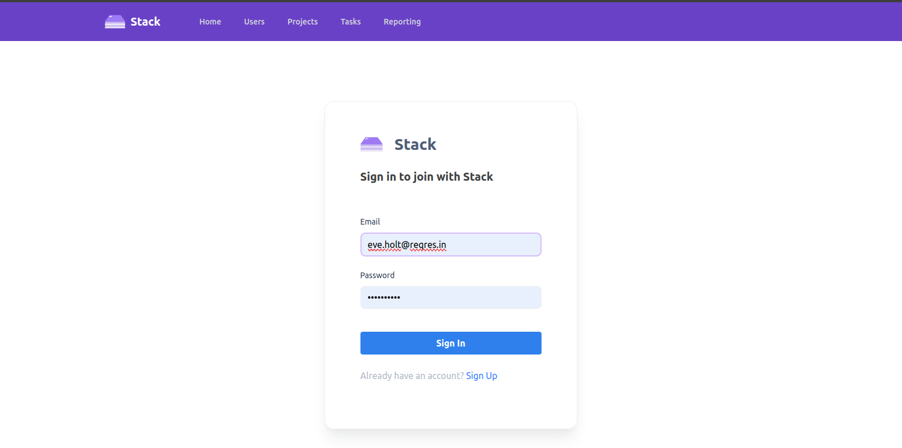
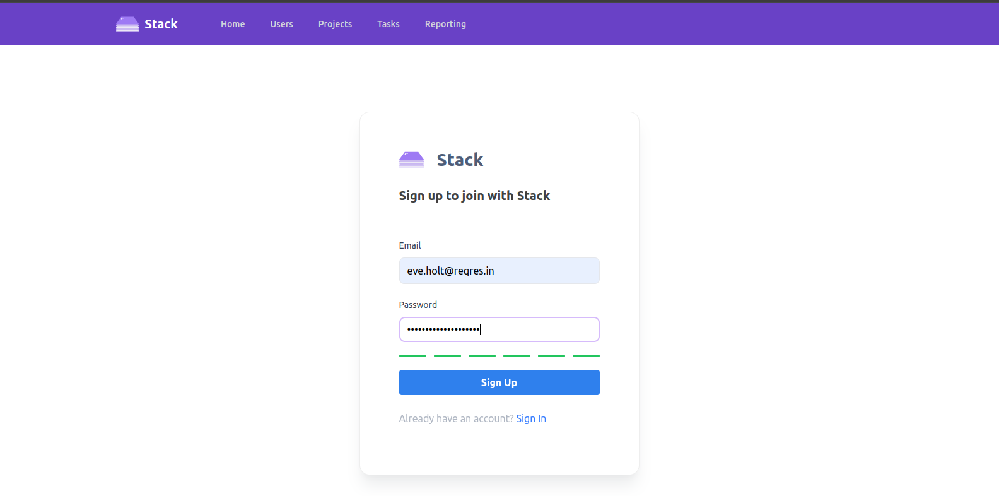
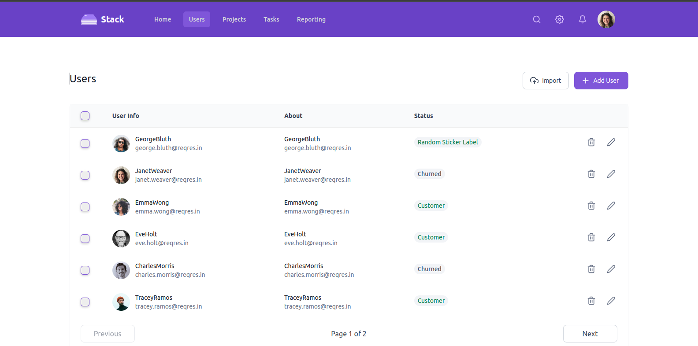
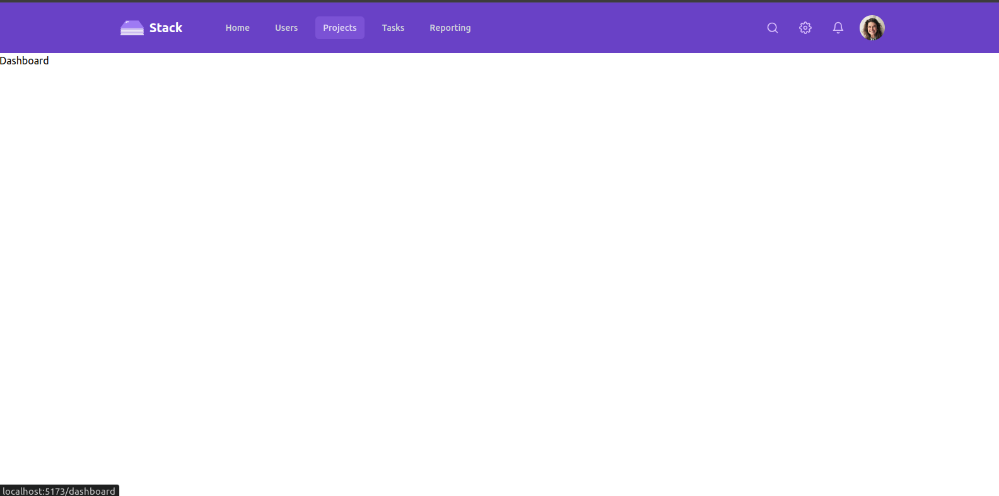

# React Dashboard







[Live Demo](https://frontend-dev-task-orpin.vercel.app/)

## Table of Contents

- [Introduction](#introduction)
- [Features](#features)
- [Prerequisites](#prerequisites)
- [Installation](#installation)
- [Usage](#usage)
- [Deployment](#deployment)
- [Contributing](#contributing)
- [License](#license)

## Introduction

: A React Dashboard built with React.js, TailwindCSS and Redux Toolkit.
: Auth and user data fetching are handled by Redux Toolkit via https://reqres.in/ API.

## Prerequisites

- Node.js (v14+)
  -Javascript
  -React.js
  -CSS
  -Redux Toolkit
  -Npm
-

## Installation

1. Clone the repository:

   ```bash
   git clone https://github.com/mamun-mahmood/frontend-dev-task
   cd frontend-dev-task
   ```

2. Install dependencies:

   ```bash
   npm install
   "if there's dependency conflict run"
   npm install -f
   ```

3. Run the application:

   ```bash
   npm run dev
   ```

## Usage

- Users and Dashboard page are protected by authentication.
- Users can login with their email and password.
  - Email: eve.holt@reqres.in
  - Password: cityslicka
- Users can signup with their email and password.
- Users can view all the users in user page.
- Dashboard is a blank page.

## Deployment

- Deployed on Vercel
- [Live Demo](https://frontend-dev-task-orpin.vercel.app/)

## Contributing

- Pull requests are welcome. For major changes, please open an issue first to discuss what you would like to change.
- Please make sure to update tests as appropriate.

## License

[MIT](https://choosealicense.com/licenses/mit/)
